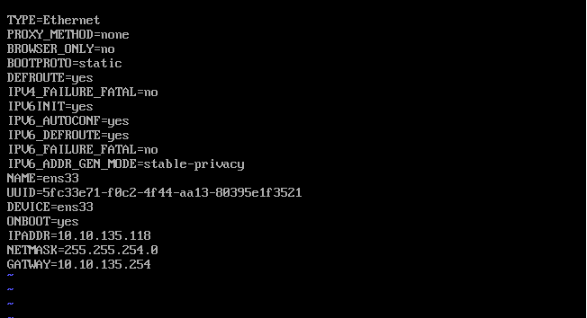
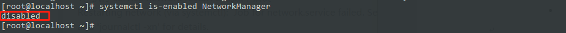
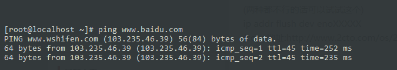

-   Docker

    -   Docker安装命令

        -   yum install -y yum-utils device-mapper-persistent-data lvm2

            -   安装centos yum工具类库

        -   yum-config-manager --add-repo
            <http://mirrors.aliyun.com/docker-ce/linux/centos/docker-ce.repo>

            -   添加一个yum的源 (阿里云docker-ce源)

        -   yum list docker-ce --showduplicates \| sort -r

            -   查看yum列表中是否存在了docker-ce

        -   yum install -y docker-ce

            -   安装docker-ce

        -   systemctl start docker.service

            -   启动docker服务

        -   systemctl enable docker.service

            -   将docker服务设置为开机启动

    -   Docker-compose安装

        -   yum -y install epel-release

        -   yum -y install python-pip

        -   pip install --upgrade pip

        -   pip install docker-compose

        -   文档地址https://www.cnblogs.com/YatHo/p/7815400.html

    -   Docker安装Gitlab 中文社区版

        -   docker run -d -p 8443:443 -p 8081:8081 -p 33:22 --name gitlab
            --restart unless-stopped -v /mnt/sda1/gitlab/etc:/etc/gitlab -v
            /mnt/sda1/gitlab/log:/var/log/gitlab -v
            /mnt/sda1/gitlab/data:/var/opt/gitlab beginor/gitlab-ce

    -   Docker安装jenkins

        -   mkdir /home/jenkins_home

        -   docker run -d --name myjenkins -p 8080:8080 -v
            /home/jenkins_home:/home/jenkins_home jenkins

    -   Docker安装Redis命令

        -   docker run -p 6379:6379 -v \$PWD/data:/data -d redis redis-server
            --appendonly yes

            -   这个命令中的\$PWD/data代表当前目录下/data会被映射到镜像中代替镜像中的/data文件夹

    -   Docker安装Consul命令:

        -   docker run -d -p 8500:8500 -h node1 --name node1 consul agent
            -server -bootstrap-expect=1 -node=node1 -client 0.0.0.0 –ui

            -   这是单节点部署的consul命令

    -   Docker安装RabbitMq的命令

        -   docker run -d --hostname my-rabbit --name rabbitserver -p
            15672:15672 -p 5672:5672 rabbitmq:management

    -   Docker删除none镜像命令:

        -   docker-compose rmi none images: docker images\|grep none\|awk
            '{print \$3 }'\|xargs docker rmi

Centos服务器NodeJs问题：

-   Node-sass安装问题

    -   npm install node-sass\@4.9.4 -g --unsafe-perm

Centos 服务安装dotNetCore2.1环境

-   sudo rpm -Uvh
    <https://packages.microsoft.com/config/rhel/7/packages-microsoft-prod.rpm>

-   sudo yum update

-   sudo yum install dotnet-sdk-2.1 -y

    -   [微软相关文档](https://dotnet.microsoft.com/download/linux-package-manager/centos/sdk-2.1.603)

Centos服务器部署步骤:

-   VMware Workstation Pro安装Centos

    -   省略….

-   修改ifcfg-ensxx文件

    -   这个文件为linux网卡文件

    -   用Vi命令打开文件（Vim等编辑器都行）

        -   vi
            /etc/sysconfig/network-script/ifcfg-ens33（ifcfg-ens33为文件名自行查看系统相关文件名称）

        -   定义与网卡相关的参数

            -   静态或动态分配ip

            -   是否开机启动

            -   等等..相关参数

        -   修改开机启动项

            -   ONBOOT=yes

        -   保存并退出

            -   :wq

        -   重启网卡服务

            -   service network restart

    -   yum源更新

        -   yum update –y

    -   修改网卡动态ip为静态

        -   用vi命令打开网卡配置文件

            -   vi /etc/sysconfig/network-script/ifcfg-ens33

        -   修改相关配置

            -   BOOTPROTO=static（将策略改为静态Ip）

            -   IPADDR=10.10.135.220(这里自定义ip地址)

            -   NETMASK=255.255.254.0(公司使用的子网掩码)

            -   GATWAY=10.10.135.254(公司使用的网关Ip地址)

        -   保存并退出

            -   :wq

        -   内容截图

-   至此网卡驱动修改完毕

    -   由于Centos的NetworkManager会和Linux的network.server冲突所以需要关闭NetworkManager服务

        -   Service NetworkManager stop

    -   然后再设置开启不启动NetworkManager

        -   chkconfig NetworkManager off

        -   验证一下

        -   systemctl is-enabled NetworkManager

        -   截图

-   最后需要添加一个route文件好让静态Ip可以找到网关

    -   vi /etc/sysconfig/network-scripts/route-ens33

        -   内容：default via 10.10.135.254 dev ens33

            -   大意就是网卡ens33默认通过10.10.135.254联网

        -   Ok网络设置完成 可以测试一下

            -   ping [www.baidu.com](http://www.baidu.com)

-   别忘了关闭Linux防火墙

-   网络设置完成可以开始安装Docker了

Centos安装NodeJs最新版本

-   使用Yum安装Nodejs

    -   Yum install nodejs

    -   这个时候装的nodejs不是最新版的 安装n

        -   npm install –g n

    -   安装完毕后安装最新版nodejs

        -   n latest

    -   若安装指定版本

        -   n 10.1.3(版本号)

    -   切换版本

        -   n

    -   此时版本未切换完成是因为在环境变量中的nodejs路径不是n安装的最新版本那个路径
        需要修改环境变量

        -   which node

        -   /usr/local/bin/node \#我的路径地址

        -   vim \~/.bash_profile

        -   将下面两行代码插入到文件末尾：

            -   export N_PREFIX= /usr/local/bin \#node实际安装位置

            -   export PATH=\$N_PREFIX/bin:\$PATH

    -   编辑完成后 esc :wq 保存退出

    -   执行source使修改生效

        -   source \~/.bash_profile

-   使用n 切换版本

-   完成
